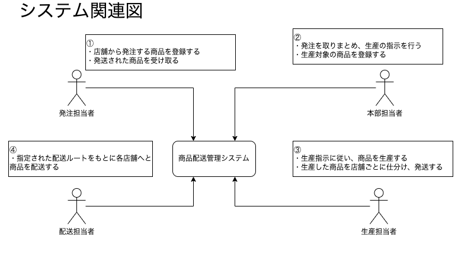
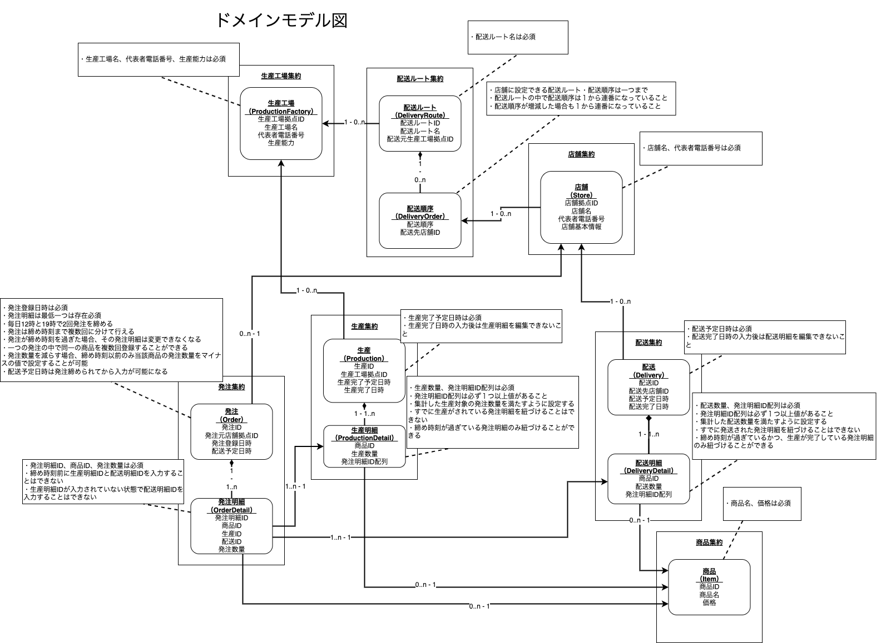

# ktor-ddd-demo

Kotlin/KtorでDDDの実装デモをおこなうためのレポジトリ。

Kotlin, Ktorに慣れることが主目的。

本レポジトリは [DddEndow/sample-ddd-laravel](https://github.com/DddEndow/sample-ddd-laravel) を参考にしたもの。

プロジェクト内容に関しては参考元を確認のこと。

## プロジェクト資料

### システム関連図

### ドメインモデル図

### ER図

